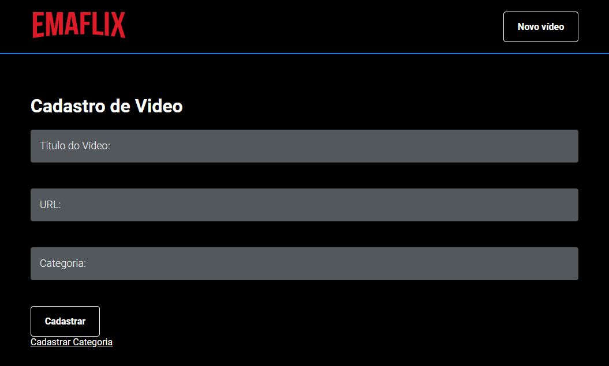

Plataforma de compartilhamento de vídeos contruído durante a semana da Imersão React da Alura.

### Screenshots

#### Web
<p align="center">
  
  
  
</p>

### Como rodar?

```shell
git clone https://github.com/FusRoDah061/emaflix.git

npm i

# Subindo simultaneamente backend e frontend
npm run dev

# Acesse a aplicação em http://localhost:3000
# Acesse a API em http://localhost:3001
```
